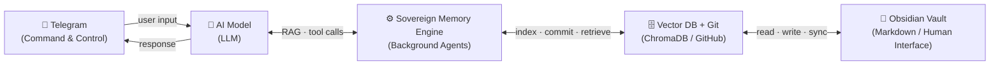

# Sovereign-Link

> **Sovereign-Link is not a chatbot. It is a Sovereign Memory Engine.**

---

## The Vision

Most people use AI as an emotional airbag.

They vent into it. They ask it to reassure them. They let it absorb the shock of their own patterns — and then they move on, unchanged. The conversation disappears. The insight evaporates. The cycle continues.

**This is not that.**

Sovereign-Link was built on a different premise: that the most dangerous thing you can do with AI is make it comfortable. Comfort is friction removal. And friction, in the right places, is what forces the brain to restructure.

The tool exists to do one thing: **give the observer a structural map of their own destructive patterns** — not to validate them, but to make them visible, nameable, and therefore interruptible.

This is AI as **architecture for recovery and autonomy**. Not a mirror that flatters. A blueprint that reveals.

When memory is owned — when insights are stored in *your* vault, on *your* machine, under *your* version control — the infrastructure of self-knowledge belongs to you. Not to a corporate server. Not to a session that expires. To you.

That is what *Sovereign Memory* means.

> The observer who maps their own patterns owns the only leverage point that matters: the moment before the next repetition.

This project is the technical harness for that process. The philosophical framework lives at **[Fractalisme.nl](https://fractalisme.nl)**.

---

## What It Is

A private Telegram bot that gives you conversational access to your local [Obsidian](https://obsidian.md/) vault (or any folder of Markdown files). Runs entirely on your own machine — no data leaves your infrastructure.

---

## Navigation

- [Features](#features)
- [Architecture](#architecture)
- [Requirements](#requirements)
- [Setup](#setup)
- [Running as a systemd service](#running-as-a-systemd-service)
- [Bot commands](#bot-commands)
- [Sovereign Memory Engine](#sovereign-memory-engine)
- [Technical Architecture: The Four Layers](#technical-architecture-the-sovereign-memory-system)
- [Project structure](#project-structure)

---

## Features

- **Chat with your vault** — ask questions, get summaries, or search by meaning across all your notes
- **Semantic search (RAG)** — `nomic-embed-text` embeddings + ChromaDB find relevant fragments by context, not just filenames
- **Read & write notes** — the AI can read existing vault files or create new ones on your behalf
- **Sovereign Memory Engine** — automatically extracts High-Value Insights (HVIs) from conversations and saves them as structured `SovereignLog` files in the vault; relevant past memories are injected into the system prompt at session start
- **Memory continuity** — memory is extracted automatically every 20 messages, on `/clear`, and on bot shutdown so nothing is ever lost
- **Vault watcher** — a background filesystem observer auto-indexes any `.md` file written to the vault outside of the bot (e.g. from Obsidian directly)
- **Voice transcription** — send voice messages or audio files; transcribed locally using [faster-whisper](https://github.com/SYSTRAN/faster-whisper) before being sent to the LLM
- **Image understanding** — send photos with an optional caption; the LLM analyses them inline
- **Website analysis** — share a URL and the bot fetches and extracts the page content (via trafilatura) for summarisation or saving
- **Vault snapshots** — `/vault` summarises the last 5 exchanges and saves a structured note with wikilinks to related files
- **Git sync** — all vault writes are committed and pushed automatically
- **Fully local & private** — LLM, embeddings, transcription, and vector DB all run on your own hardware; optionally point the main LLM at a cloud provider via `OLLAMA_BASE_URL`/`OLLAMA_API_KEY`

---

## Architecture

```
Telegram ──► bot.py ──► llm.py ──► Ollama-compatible API (LLM)
                   │         └──► tools.py ──► read_vault / write_vault / sync_vault
                   │                      └──► analyze_website (trafilatura)
                   │                      └──► vector.py (semantic search, ChromaDB)
                   │
                   └──► memory_manager.py ──► Sovereign Memory Engine (HVI extraction)
                             └──► vector.py ──► ChromaDB (cosine search)
```

---

## Requirements

- Python 3.11+
- [Ollama](https://ollama.com/) running locally (or any OpenAI-compatible API endpoint)
- A Telegram bot token (from [@BotFather](https://t.me/BotFather))
- A vault directory of Markdown files (e.g. an Obsidian vault with git initialised)

---

## Setup

### 1. Clone the repo

```bash
git clone https://github.com/operator33sh/sovereign-link.git
cd sovereign-link
```

### 2. Create a virtual environment and install dependencies

```bash
python3 -m venv .venv
.venv/bin/pip install -r requirements.txt
```

### 3. Pull the required Ollama models

```bash
ollama pull llama3.1          # or whichever chat model you prefer
ollama pull nomic-embed-text  # for semantic search embeddings
```

### 4. Configure environment variables

Create a `.env` file in the project root:

```env
TELEGRAM_BOT_TOKEN=your_telegram_bot_token
ALLOWED_USER_ID=your_telegram_user_id        # only this user can interact with the bot

VAULT_PATH=/path/to/your/vault               # local folder of .md files

# Main LLM (can be Ollama or any OpenAI-compatible endpoint)
OLLAMA_BASE_URL=http://localhost:11434
OLLAMA_API_KEY=                              # leave empty for local Ollama
OLLAMA_MODEL=llama3.1

# Embeddings (always local Ollama)
EMBED_BASE_URL=http://localhost:11434
EMBED_MODEL=nomic-embed-text
CHROMA_PATH=~/.sovereign-link/chroma         # where ChromaDB stores its index

# Vision model — optional, defaults to OLLAMA_MODEL
# VISION_MODEL=llava                         # any vision-capable model (llava, qwen3-vl, etc.)

# Voice transcription — optional, defaults shown
# WHISPER_MODEL=small                        # tiny / base / small / medium / large

# Custom system prompt — optional
# SYSTEM_PROMPT=You are a personal assistant...
```

To find your Telegram user ID, message [@userinfobot](https://t.me/userinfobot).

### 5. Index your vault (first time only)

**ChromaDB semantic index:**
```bash
.venv/bin/python ingest.py
```

Re-run this script if you add many files outside of the bot. Files written via the bot are indexed automatically.

### 6. Run the bot

```bash
.venv/bin/python main.py
```

---

## Running as a systemd service

A service unit file is included. To install it:

```bash
sudo cp sovereign-link.service /etc/systemd/system/
sudo systemctl daemon-reload
sudo systemctl enable sovereign-link
sudo systemctl start sovereign-link
```

Check logs with:

```bash
journalctl -u sovereign-link -f
```

---

## Bot commands

| Command | Description |
|---------|-------------|
| `/start` | Check if the bot is online |
| `/clear` | Clear the current session context and save a memory log |
| `/vault` | Summarise the last 5 exchanges as a structured vault note and push to git |
| `/memory` | Manually trigger the Sovereign Memory Engine on the current conversation |
| `/whisper` | Generate a tweet-length insight from a random vault fragment |

Any other text message is handled by the LLM with access to all tools. Voice messages and photos are also supported directly.

---

## Sovereign Memory Engine

The memory engine runs as part of the bot (no separate process needed). It:

1. Scans the conversation for High-Value Insights — psychological breakthroughs, redefined values, recurring patterns, or architectural decisions
2. Searches the vault for related prior memory logs to build associative `[[wikilinks]]`
3. Writes a structured `SovereignLog` file to `memory/YYYY-MM-DD_TOPIC_SovereignLog.md`
4. Commits and pushes the result to git

Memory is triggered automatically every 20 messages, on `/clear`, and on bot shutdown. At the start of each new session the top 3 most relevant past memory logs are injected into the system prompt.

---

## Technical Architecture: The Sovereign Memory System



### Layer 1 — Interface

| Component | Role |
|-----------|------|
| 📱 **Telegram** | Primary command-and-control surface. All real-time interaction, voice, images, and commands flow through this interface. |
| 🧠 **LLM (AI Model)** | Central processing unit. Handles reasoning, planning, tool orchestration, and natural language understanding across all domains. |

### Layer 2 — Memory & Persistence

| Component | Role |
|-----------|------|
| 📂 **Obsidian Vault** | The human-readable interface to long-term memory. All structured knowledge lives here as navigable, linkable notes. |
| **Markdown** | The universal, future-proof data format. Plain text with `[[wikilinks]]` ensures portability across any tool or era. |
| **Git / GitHub** | The backbone for version control, multi-device synchronization, and disaster recovery. Every vault write is committed and pushed automatically. |

### Layer 3 — Intelligence & Retrieval (The Core)

| Component | Role |
|-----------|------|
| **RAG** | Grounds the AI in the Vault's truth rather than generic training data. Relevant fragments are retrieved and injected into context before every response. |
| 🗄️ **Vector Database (ChromaDB)** | Enables semantic search. Information is retrieved by meaning and context — not just filename or keyword match. Powered by `nomic-embed-text` embeddings running locally. |
| ⚙️ **Sovereign Memory Engine** | Autonomous background agents that scan conversations for High-Value Insights (HVIs), synthesize structured `SovereignLog` files, build associative `[[wikilinks]]` to prior memory, and commit everything to git — automatically and continuously. |
| **Active Context Layer (ACL)** | A high-priority briefing file (`.system/active_briefing.md`) that dynamically steers AI behavior based on the user's current operational state, priorities, and active focus areas. Loaded at session start to orient every interaction. |

### Layer 4 — Framework

| Component | Role |
|-----------|------|
| **The Harness** | A systemic set of psychological guardrails and operational constraints embedded in the system prompt. Defines the AI's behavioral contract, boundaries, and tone. |
| **Fractalism** | The philosophical framework governing how data is organized and interconnected. Notes relate to other notes in self-similar, recursive patterns — mirroring how understanding actually develops. See [Fractalisme.nl](https://fractalisme.nl). |

### Data Flow

1. A message arrives via **Telegram** and is passed to the 🧠 **LLM**.
2. The LLM issues tool calls to the ⚙️ **Sovereign Memory Engine**, which queries the 🗄️ **Vector DB** for semantically relevant vault fragments.
3. Retrieved context is injected into the LLM's reasoning window alongside the **ACL briefing**.
4. The LLM formulates a response and may invoke write tools — creating or updating 📂 **Markdown** notes in the **Obsidian Vault**.
5. All writes are committed via **Git** and pushed to **GitHub** for synchronization and backup.
6. Every 20 messages (and on `/clear` or shutdown), the Sovereign Memory Engine extracts HVIs, writes a `SovereignLog`, and pushes it — ensuring no insight is ever lost.

---

## Project structure

```
sovereign-link/
├── main.py               # Entry point
├── bot.py                # Telegram handlers and command routing
├── llm.py                # Ollama LLM client, tool call loop, audio transcription
├── context.py            # In-memory conversation history
├── tools.py              # Vault tools: read, write, sync, semantic search, web fetch
├── vector.py             # ChromaDB + Ollama embedding logic + filesystem watcher
├── memory_manager.py     # Sovereign Memory Engine (Extract→Synthesize→Store→Sync)
├── ingest.py             # One-shot ChromaDB vault indexer
├── requirements.txt
└── sovereign-link.service  # systemd unit
```

---

## License

MIT
